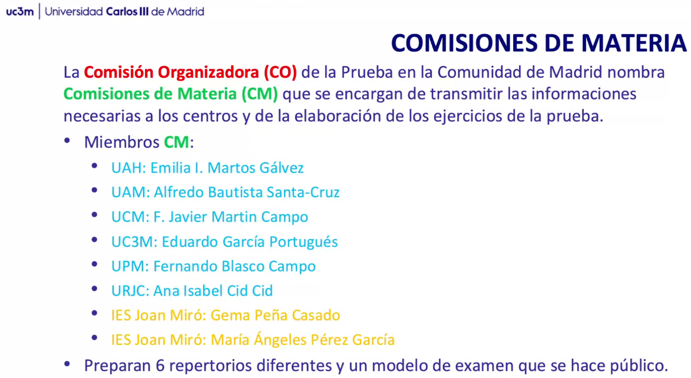
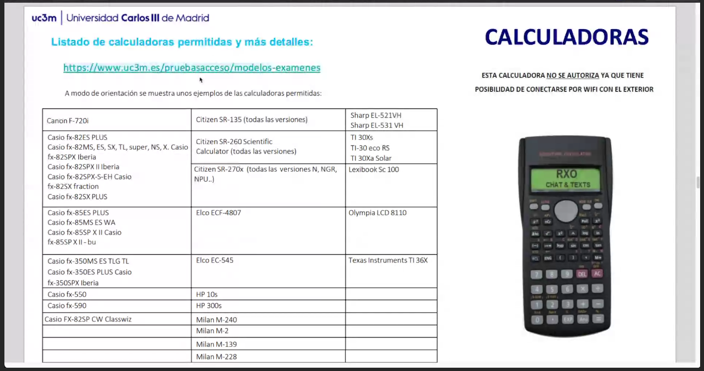

# REUNIÓN PAU 2025 - 2026
Prof. D. Eduardo García Portugués
Universidad Carlos III de Madrid
Dpto. Estadistica
Telf.: 91 624 88 36
E-Mail: edgarcia@est-econ.uc3m.es

- misma estructura que año pasado
    - 2.5 puntos cada uno
    - el primer ejercicio es no optativo y de carácter competencial, o sea, que presentará un mayor contexto al que referirán las soluciones obtenidas
    - el resto con optatividad intrabloques: se elige 2.1 o 2.2; 3.1 o 3.2; 4.1 o 4.2
    - dos ejercicios de PROBABILIDAD Y ESTADÍSTICA; uno de ANÁLISIS; uno de ÁLGEBRA
- sí es necesaria la corrección por continuidad en aproximación de la binomial por la normal: Yates. Se penaliza si no se aplica.
- puntuación del examen en múltiplos de 0,1.
- descuento por falta de ortografía en múltiplos de 0,1 puntos y casuística simplificada
    - hasta un punto menos por ortografía
    - los dos primeros errores no descuentan
    - cada falta descuenta 0,1
    - un máximo de medio punto por errores de redacción, presentación, falta de coherencia, incorrección léxica, etc.
- calculadoras:
    - nada de programables, ni pantallas gráficas, ni resolución de ecuaciones, ni operaciones con matrices, determinantes, derivadas, integrales, almacenamiento de datos...
    - listado de calculadoras permitidas:  https://www.uc3m.es/pruebasacceso/media/pruebasacceso/doc/archivo/doc_calculadoras/20250217-calculadoras-permitidas.pdf

## RUEGOS Y PREGUNTAS:
- los de necesidades están en un aula especial. (gonzalo). se les da un cuadernillo grapado, con cuatro páginas evaluables. dos páginas para hacer cuentas en sucio. 
- no se pide de manera específica que hagan Gauss, Cramer o lo que sea.
- no se permite regla

