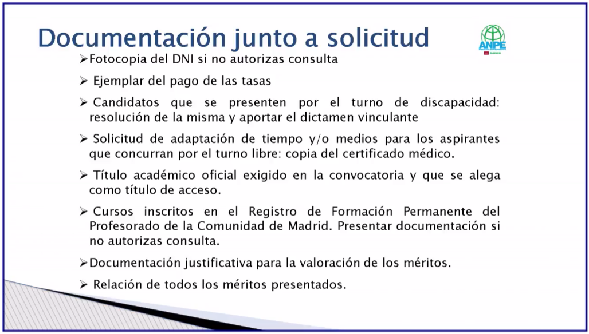
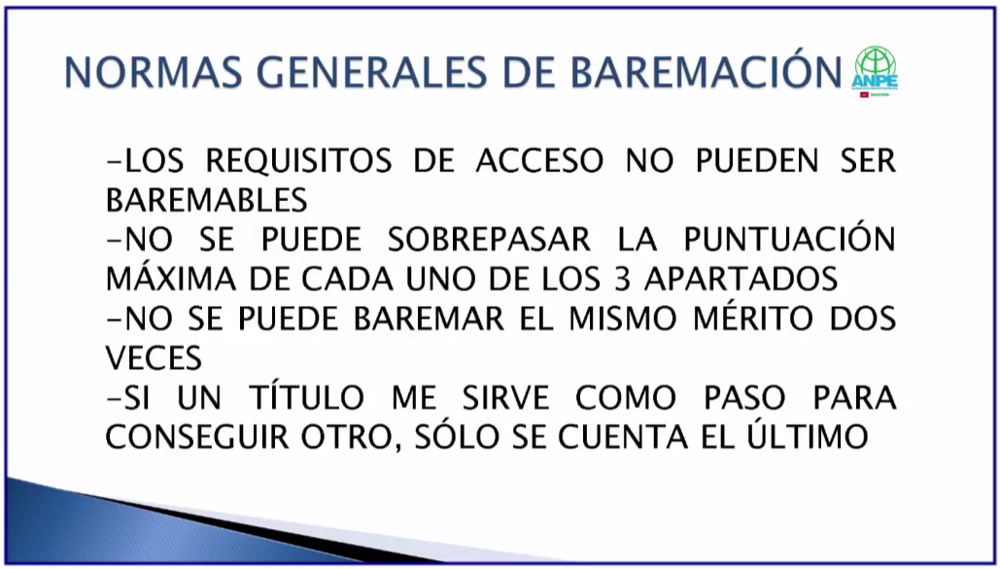

- del 3 al 28 de marzo 
- primero pagar tasas y luego hacer solicitud pq hay que escanear el recibo y mandarlo en la solicitud
- en la solicitud: adjuntar título, etc.
- suelen ser las pruebas la segunda quincena de junio
- ADO: aplicación docentes opositores
- resolucion 20 febrero
- certificado digital
- si si si a todo
- documentacion requerida
- formacion pedagogica y didactica es el master
- No me ha quedado clara una cosa en la pestaña de documentación requerida. Qué es eso de los subgrupos 3, 4 y 5? A qué se refiere?
- 3 4 y 5: 3 subgrupo superior; 5: adquisición de nuevas especialidades.

## baremo
- mejor presentar cosas de más y luego tener que aclarar lo que sea en la fase de alegaciones
- titulos fundamentales
- certificados de notas fundamentales
- el MFPES NO es baremable

- exp docente previa 5 ptos
    - en centros públicos: 1 pto por año y 0,0833 por mes
    - me dan la mitad si la experiencia es en otro cuerpo al que me presento
    - esto se justifica solicitando al centro la "hoja de servicios" si aún trabajamos ahí o si no en la DAT correspondiente si ya no trabajamos ahí
    - en privados: 0,500 por cada año y 0,0416 por mes
    - vida laboral, contrato laboral donde se refleje el puesto, nivel educativo desempeñado y certificado del director con fechas exactas de comienzo y finalización
- formación académica 5 ptos
    - nota del expediente cuenta 1,5 si superas el 7,5 y 1 si estás por debajo
    - se tienen que presentar todas las notas de todas las asignaturas
    - si no aparece nota media esta la calcula la comisión de baremación haciendo la media aritmética
    - C2 proficiency 0,5 puntos c1 ielts 0,5 puntos. solo se valora un certificado por idioma y nivel.
- otros méritos 2 ptos
    - 

# CONCURSO OPOSICIÓN - INFO GENERAL (charla facebook anpe)

- 1877 profes convocados en secundaria
- docs importantes:
	- la convocatoria
	- el anexo VIII de la convocatoria
- Dirección General de Recursos Humanos organiza todo
- Si hay un problema habrá que dirigirse a la DAT correspondiente
	- norte: sanse o alcobendas
	- oeste: collado villalba o pozu
- requisitos indispensables:
	- nacionalidad española
	- capacidad funcional (que estes capacitado para dar tu clase)
	- certificado negativo del registro central de delincuentes sexuales
	- graduado en la carrera de turno
	- formación pedagógica y didáctica art 100.2 de la LOE. MFPES.
- abstención y recusación:
	- si hay algún muy amigo o muy enemigo en el tribunal, puedes recusarle
	- esto si lo hay o en tu tribunal o en otro
- ingreso libre: (tu modo de ingreso)
	- fase 1: oposición - prueba conocimientos
		- parte A: práctica 0,7 (específico de especialidad)
		- parte B: tema 0,3 (específico de especialidad)
	- fase 2: concurso - aptitud pedagógica (solo los que superen la fase de oposición)
		- parte A: programación didáctica 0,3
		- parte B: exposición oral de unidad didáctica 0,7
	- fase 3: prácticas
	- las 3 son eliminatorias. fase 1 vale 2/3. fase 2 vale 1/3. fase 3 es apto o no apto.

- temarios son los de siempre. los tienes tú por ahí guardados.

- fase de oposición:
	- se valora: que sepamos, que sepamos enseñar, capacidad oral y escrita
	- a partir de la segunda quincena. lo publicarán en el BOCM. probably finales junio
	- esto se publica tb en la pagina +educación
	- super imprescindible llegar a tiempo
	- en la primera fase hay que sacar un mínimo de 2,5 en las 2 partes y hay que aprobar

# CONCURSO DE OPOSICIÓN - INFO ESPECÍFICA DE SECUNDARIA: (tengo un monton de fotos de las diapos en el movil!)
- presumiblemente el SÁBADO 21 junio
- todas las pruebas en papel autocopiativo
	- se escribe entonces de uno en uno. no superponer uno sobre otro pq escribes en muchos a la vez.
	- solo boli de UN COLOR: azul o negro. llevar varios del mismo color
	- no tipex ni boli autoborrable.
- ejs convocatorias anteriores (mirar en la web de la comunidad de madrid)
- las pruebas prácticas las hace la comisión (los del tribunal)
- al exponer el tema: tienes que mostrar de alguna manera que lo dominas. saber ejemplificar!
- la redacción debe ser formal, y atento a la ortografía!
- los errores graves se penalizan muchísimo! ante dudas de si algo es verdad o es mentira, no lo pongas!
- para la programación didáctica: no puede superar las 80 páginas!
- tener todo lo escrito a presentar en papel por si acaso!
- en personal + educacion y en la página de la DAT se publica dónde se tienen que hacer los exámenes